# Task 1: AWS ECR (Elastic Container Registry)

## Завдання
Створіть власний репозиторій ECR, зберіть власний образ на своєму комп'ютері, авторизуйтесь у свій репозиторій ECR та push створений образ у репозиторій ECR.

## Покрокова інструкція

### Передумови
- **Регіон**: eu-central-1 (Frankfurt) — використовуйте один і той самий регіон для всіх кроків
- **AWS CLI**: встановлено та налаштовано з credentials
- **Docker**: встановлено та працює

### ⚠️ **Важлива інформація про credentials (DanIT курс):**

Для студентів курсу DanIT доступ до AWS здійснюється через спеціальну систему тимчасових credentials:

1. **Базові credentials** (Access Key ID/Secret Key) створюються в AWS Console, але мають обмежені права
2. **Тимчасові credentials** з повними правами отримуються через спеціальний скрипт `dan_it_aws_login.sh`
3. **MFA (Multi-Factor Authentication)** обов'язковий для отримання робочих credentials

#### Процес отримання робочих credentials:
```bash
# Запуск спеціального скрипта DanIT
./dan_it_aws_login.sh

# Скрипт запросить MFA код з вашого телефону
Enter MFA code: [ваш-6-значний-код]

# Після успішної автентифікації створюються тимчасові credentials
Temporary credentials saved under profile 'default'.
```

**Примітка**: Детальний код скрипта та MFA налаштування не публікуються з міркувань безпеки курсу.

### Крок 1: Створення AWS Access Keys (базові credentials)

#### ⚠️ **Примітка для DanIT курсу:**
Ці базові credentials мають обмежені права та використовуються тільки для автентифікації в скрипті `dan_it_aws_login.sh`. Робочі credentials з повними правами генеруються автоматично після MFA підтвердження.

#### Як потрапити до створення Access Keys:
1. В **AWS Management Console** знайдіть сервіс **IAM**
2. В лівому меню виберіть **"Security credentials"**
3. Прокрутіть до розділу **"Access keys"**
4. Натисніть **"Create access key"**

#### Детальні кроки створення:

**1.1 Початок створення Access Key**
- Виберіть **"Command Line Interface (CLI)"** як use case
- Поставте галочку **"I understand the above recommendation"**
- Натисніть **"Next"**
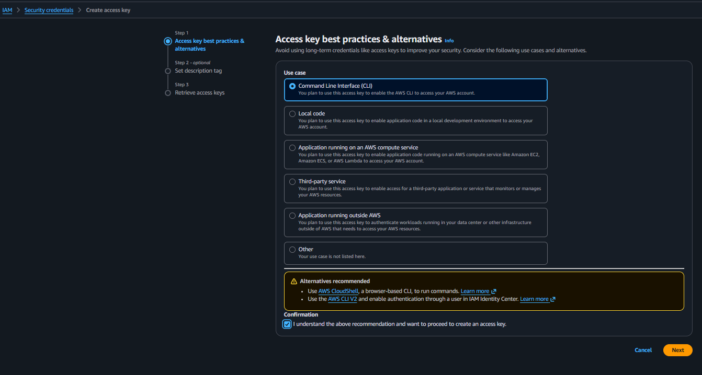

**1.2 Завершення створення та збереження**
- Додайте **Description tag** (опціонально): `ECR access key for DevOps course`
- Натисніть **"Create access key"**
- **⚠️ ВАЖЛИВО**: Збережіть **Access Key ID** та **Secret Access Key**
- Натисніть **"Download .csv file"** або скопіюйте дані
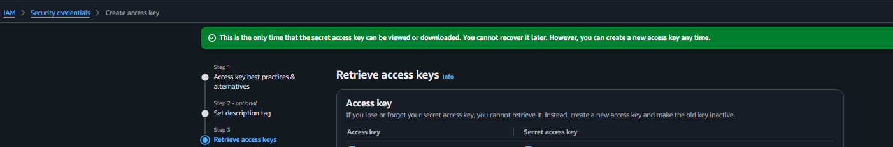

**1.3 Налаштування AWS профілю для DanIT курсу**

Після отримання базових credentials необхідно налаштувати AWS профіль для роботи зі скриптом автентифікації:

```bash
# Налаштування базового профілю для DanIT курсу
aws configure --profile danit-without-mfa

# Введіть отримані credentials:
AWS Access Key ID [None]: [ваш-access-key-id]
AWS Secret Access Key [None]: [ваш-secret-access-key]
Default region name [None]: eu-central-1
Default output format [None]: json
```

**⚠️ Важливо**: Цей профіль містить тільки базові credentials з обмеженими правами. Для отримання повних прав необхідно запустити скрипт MFA автентифікації:

```bash
# У WSL/Linux терміналі запустіть скрипт DanIT
./dan_it_aws_login.sh

# Скрипт використає профіль danit-without-mfa для автентифікації
# та створить тимчасові credentials з повними правами
```

Після успішного виконання скрипта ви матимете робочі credentials для виконання AWS команд.

### Крок 2: Створення ECR репозиторію

#### Як потрапити до створення ECR:
1. В **AWS Management Console** знайдіть сервіс **ECR**
2. Виберіть **"Amazon Elastic Container Registry"**
3. Натисніть **"Create repository"**

#### Детальні кроки створення:

**2.1 Налаштування репозиторію**
- **Visibility settings**: виберіть **"Private"**
- **Repository name**: введіть назву (наприклад: `sk-my-web-app`)
- **Tag immutability**: залишіть **"Mutable"**
- **Image scan settings**: можна увімкнути **"Scan on push"**
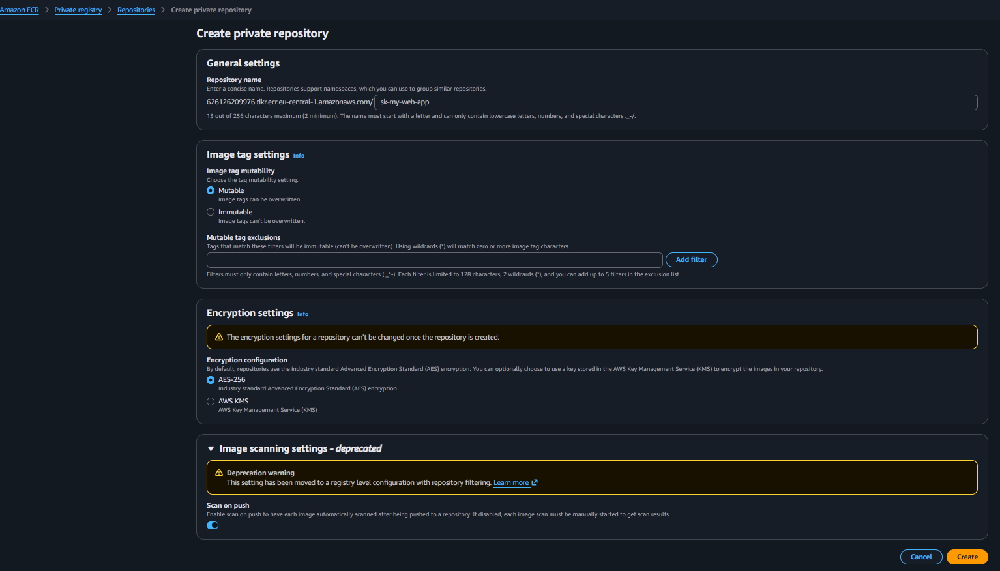

**2.2 Створення репозиторію**
- **Encryption settings**: залишіть **"AES-256"** (за замовчуванням)
- Натисніть **"Create repository"**
- Збережіть **Repository URI** для подальшого використання
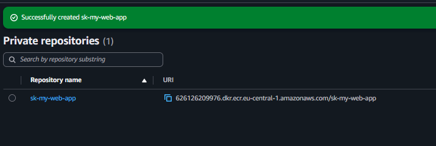

### Крок 3: Створення та збірка Docker образу

#### Як створити Docker образ:
1. Створіть **Dockerfile** з веб-сервером Apache
2. Створіть **index.html** з кастомним контентом
3. Зберіть образ за допомогою Docker

#### Детальні кроки створення:

**3.1 Збірка Docker образу**
Створіть файли та виконайте команди:

**Dockerfile:**
```dockerfile
# Використовуємо базовий образ Apache
FROM httpd:2.4

# Копіюємо наш HTML файл в папку Apache
COPY index.html /usr/local/apache2/htdocs/

# Відкриваємо порт 80
EXPOSE 80

# Запускаємо Apache
CMD ["httpd-foreground"]
```

**index.html:**
```html
<!DOCTYPE html>
<html lang="uk">
<head>
    <meta charset="UTF-8">
    <meta name="viewport" content="width=device-width, initial-scale=1.0">
    <title>DevOps Task 18 - ECR Demo</title>
    <style>
        body {
            font-family: Arial, sans-serif;
            background: linear-gradient(135deg, #667eea 0%, #764ba2 100%);
            margin: 0;
            padding: 50px;
            color: white;
            text-align: center;
        }
        .container {
            background: rgba(255, 255, 255, 0.1);
            padding: 40px;
            border-radius: 15px;
            backdrop-filter: blur(10px);
            box-shadow: 0 8px 32px rgba(0, 0, 0, 0.1);
        }
        h1 {
            font-size: 2.5em;
            margin-bottom: 20px;
        }
        .info {
            font-size: 1.2em;
            margin: 20px 0;
        }
    </style>
</head>
<body>
    <div class="container">
        <h1>🚀 AWS ECR Demo</h1>
        <div class="info">
            <p><strong>Проект:</strong> DevOps Task 18</p>
            <p><strong>Технології:</strong> Docker + AWS ECR</p>
            <p><strong>Статус:</strong> ✅ Успішно розгорнуто!</p>
        </div>
        <p>Цей веб-сервер Apache працює в Docker контейнері, який було завантажено в AWS ECR!</p>
        <p><em>Створено для навчального курсу DevOps</em></p>
    </div>
</body>
</html>
```

**Команди для збірки:**
```bash
# Збірка образу
docker build -t sk-my-web-app .

# Перевірка образів
docker images
```
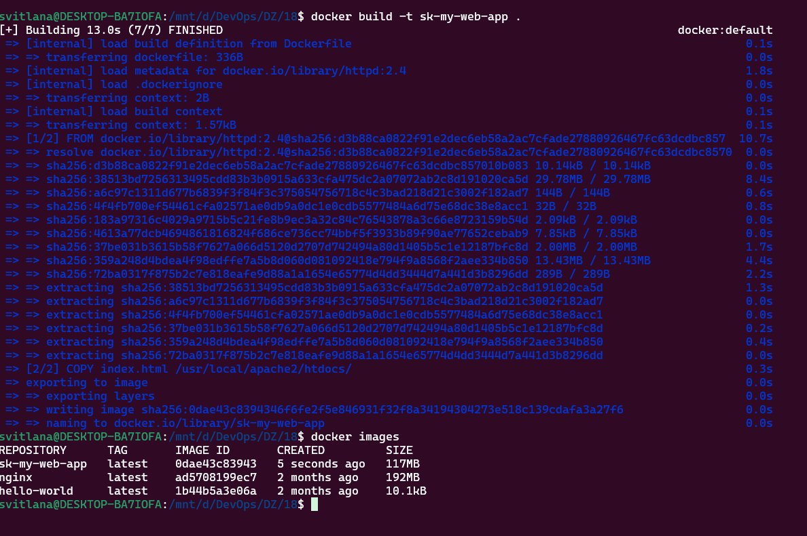

**3.2 Тестування образу локально**
```bash
# Запуск контейнера для тесту
docker run -d -p 8080:80 --name test-web sk-my-web-app

# Перевірка роботи
curl http://localhost:8080

# Зупинка тестового контейнера
docker stop test-web && docker rm test-web
```
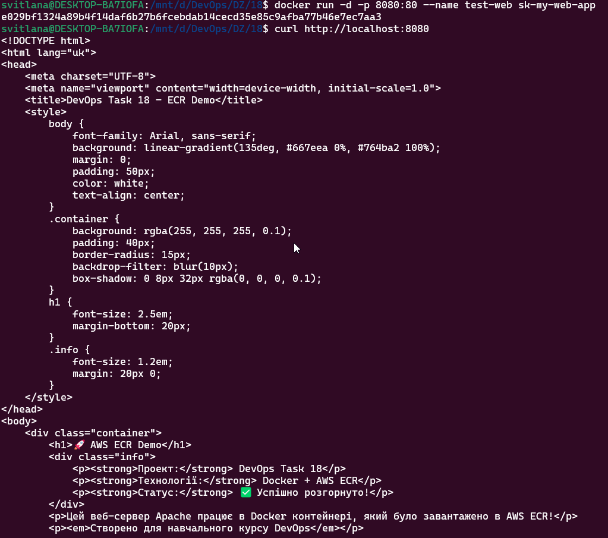

### Крок 4: Авторизація та Push образу в ECR

#### Як отримати команди push:
1. В **ECR Console** відкрийте ваш репозиторій
2. Натисніть кнопку **"View push commands"**
3. Скопіюйте та виконайте команди

#### Детальні кроки push:

**4.1 Отримання Push Commands**
В ECR репозиторії натисніть **"View push commands"** щоб побачити всі необхідні команди для:
- Авторизації в ECR
- Тегування образу
- Push образу в репозиторій
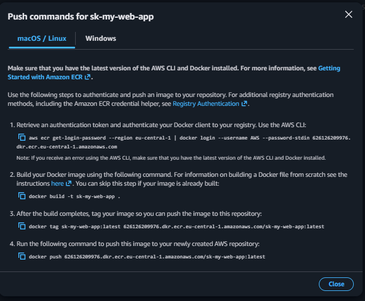

**4.2 Виконання авторизації та push**
Виконайте команди в терміналі:

```bash
# 1. Авторизація в ECR
aws ecr get-login-password --region eu-central-1 | docker login --username AWS --password-stdin 626126209976.dkr.ecr.eu-central-1.amazonaws.com

# 2. Тегування образу для ECR
docker tag sk-my-web-app:latest 626126209976.dkr.ecr.eu-central-1.amazonaws.com/sk-my-web-app:latest

# 3. Push образу в ECR
docker push 626126209976.dkr.ecr.eu-central-1.amazonaws.com/sk-my-web-app:latest
```
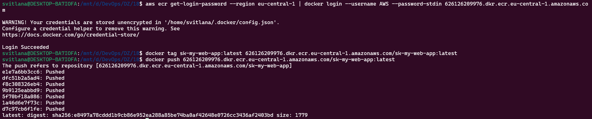

### Крок 5: Перевірка результату

**5.1 Перевірка образу в ECR**
Поверніться до ECR Console та перевірте, що образ успішно завантажено:
- Перегляньте список образів у репозиторії
- Перевірте розмір та тег образу
- Переконайтеся, що статус показує успішний upload
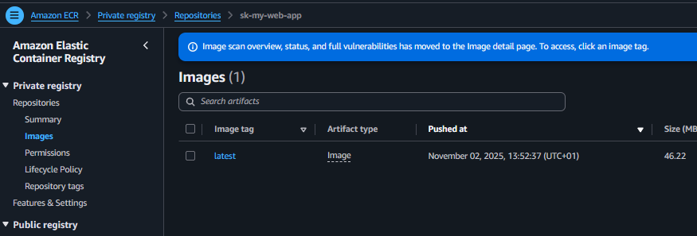

## Команди для роботи з ECR

### Авторизація в ECR:
```bash
# Отримання токену авторизації
aws ecr get-login-password --region eu-central-1 | docker login --username AWS --password-stdin [ACCOUNT-ID].dkr.ecr.eu-central-1.amazonaws.com
```

### Робота з образами:
```bash
# Збірка образу
docker build -t repository-name .

# Тегування для ECR
docker tag repository-name:latest [ACCOUNT-ID].dkr.ecr.eu-central-1.amazonaws.com/repository-name:latest

# Push в ECR
docker push [ACCOUNT-ID].dkr.ecr.eu-central-1.amazonaws.com/repository-name:latest

# Pull з ECR
docker pull [ACCOUNT-ID].dkr.ecr.eu-central-1.amazonaws.com/repository-name:latest
```

### Корисні команди:
```bash
# Перегляд локальних образів
docker images

# Видалення локального образу
docker rmi repository-name:latest

# Перегляд репозиторіїв ECR
aws ecr describe-repositories --region eu-central-1

# Перегляд образів у репозиторії
aws ecr list-images --repository-name repository-name --region eu-central-1
```

## Файли проекту

### Dockerfile
```dockerfile
# Використовуємо базовий образ Apache
FROM httpd:2.4

# Копіюємо наш HTML файл в папку Apache
COPY index.html /usr/local/apache2/htdocs/

# Відкриваємо порт 80
EXPOSE 80

# Запускаємо Apache
CMD ["httpd-foreground"]
```

### index.html
Красивий HTML файл з стилізацією та інформацією про проект (див. повний код вище).

## Видалення ресурсів

### Видалення образів з ECR:
1. ECR Console → відкрийте репозиторій
2. Виберіть образ → Actions → Delete
3. Підтвердіть видалення
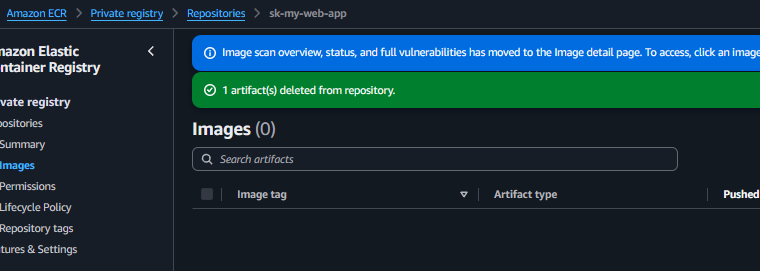

### Видалення репозиторію ECR:
1. ECR Console → Repositories
2. Виберіть репозиторій → Delete
3. Введіть `delete` для підтвердження
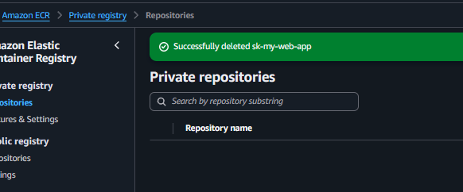

### Видалення локальних образів:
```bash
# Видалення локальних образів
docker rmi sk-my-web-app:latest
docker rmi 626126209976.dkr.ecr.eu-central-1.amazonaws.com/sk-my-web-app:latest

# Очищення системи Docker
docker system prune -a
```
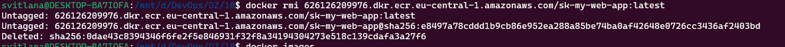

### Видалення AWS Access Keys (з міркувань безпеки):
1. **IAM Console** → **Security credentials**
2. В розділі **"Access keys"** знайдіть створений ключ
3. Натисніть **"Actions"** → **"Delete"**
4. Підтвердіть видалення введенням **"Delete"**
5. Натисніть **"Delete"**

**⚠️ Важливо для DanIT курсу**: 
- Видаляйте тільки ключі, які ви створили для цього завдання
- Базові credentials курсу залишайте для подальших завдань
- Тимчасові credentials автоматично експіруються


## Результат виконання завдання

✅ **Створено репозиторій ECR**  
✅ **Зібрано кастомний Docker образ з Apache**  
✅ **Успішно авторизовано в ECR**  
✅ **Образ завантажено в ECR репозиторій**  
✅ **Видалено образ з ECR репозиторію**  
✅ **Видалено ECR репозиторій**  
✅ **Видалено локальні Docker образи**  
✅ **Видалено AWS Access Keys (безпека)**  

## Важливі моменти

1. **Регіон**: Всі ресурси в одному регіоні (eu-central-1)
2. **Авторизація**: AWS CLI має бути налаштований з правильними credentials
3. **Docker**: Переконайтеся, що Docker запущений перед збіркою
4. **Тегування**: Обов'язково тегуйте образ перед push в ECR
5. **URI**: Використовуйте правільний ECR URI для вашого акаунту
6. **DanIT Security**: Для курсу DanIT використовуються тимчасові credentials через MFA автентифікацію

## Безпека курсу DanIT

Для забезпечення безпеки навчального середовища:
- Базові credentials мають мінімальні права
- Повні права надаються тільки через MFA верифікацію
- Тимчасові credentials автоматично експіруються
- Скрипт автентифікації захищений та недоступний поза курсом

## Технічні деталі

- **Base Image**: httpd:2.4 (Apache HTTP Server)
- **Final Image Size**: ~117MB
- **Port**: 80 (HTTP)
- **Content**: Кастомний HTML з CSS стилізацією
- **Registry**: AWS ECR (Private)
- **Authentication**: AWS IAM credentials + ECR token