# Task 2: AWS RDS (MySQL Database)

## Завдання
Створіть базу даних MySQL у сервісі AWS, підключіться до бази даних з комп'ютера за допомогою утиліти mysql та видаліть базу даних.

## Покрокова інструкція

### Крок 1: Створення Subnet Group для RDS

Перш ніж створити RDS базу даних, необхідно створити subnet group, щоб визначити в яких підмережах буде розміщена база даних.

#### Як потрапити до створення Subnet Group:
1. Увійдіть до **AWS Management Console** (https://console.aws.amazon.com)
2. В пошуковому рядку наберіть **"RDS"** та виберіть сервіс **Amazon RDS**
3. В лівому меню знайдіть секцію **"Subnet groups"**
4. Натисніть кнопку **"Create DB subnet group"**

#### Детальні кроки створення:

**1.1 Створення Subnet Group**
- Заповніть **Name** (наприклад: `my-rds-subnet-group`)
- Додайте **Description** (наприклад: `Subnet group for MySQL RDS`)
- Виберіть **VPC** (зазвичай default VPC)
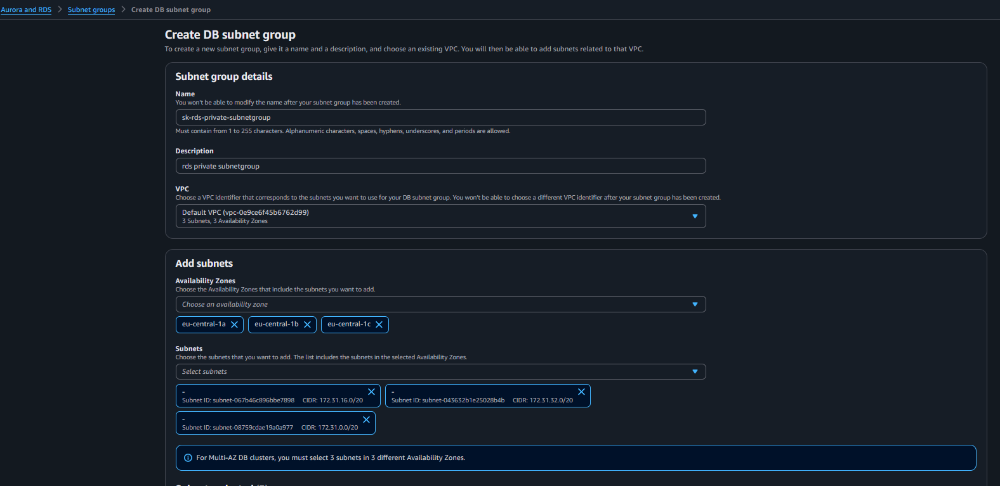

**1.2 Налаштування Subnet Group**
- Виберіть **Availability Zones** (мінімум 2 зони для Multi-AZ)
- Додайте **Subnets** з різних зон доступності
- Натисніть **"Create"** для завершення
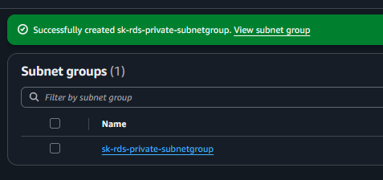

### Крок 2: Створення Security Group

Для забезпечення безпеки підключення до RDS потрібно створити security group з відповідними правилами.

#### Як потрапити до створення Security Group:
1. В **AWS Management Console** знайдіть сервіс **EC2**
2. В лівому меню знайдіть секцію **"Network & Security"**
3. Виберіть **"Security Groups"**
4. Натисніть кнопку **"Create security group"**

#### Детальні кроки створення:

**2.1 Створення Security Group**
- Введіть **Security group name** (наприклад: `rds-mysql-sg`)
- Додайте **Description** (наприклад: `Security group for RDS MySQL access`)
- Виберіть **VPC** (ту саму, що і для subnet group)
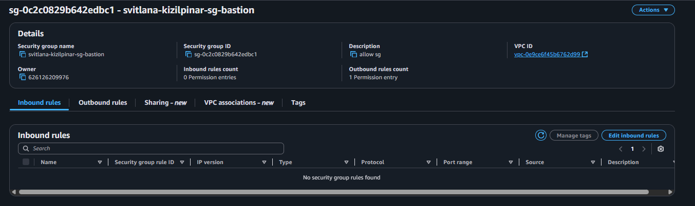

**2.2 Налаштування Inbound Rules (вхідні правила)**
Додайте наступні правила:
- **Type**: MySQL/Aurora
- **Protocol**: TCP
- **Port Range**: 3306
- **Source**: Custom (IP адреса вашого EC2 або Security Group EC2)

Також додайте правило для SSH (якщо потрібно):
- **Type**: SSH
- **Protocol**: TCP  
- **Port Range**: 22
- **Source**: My IP або Custom
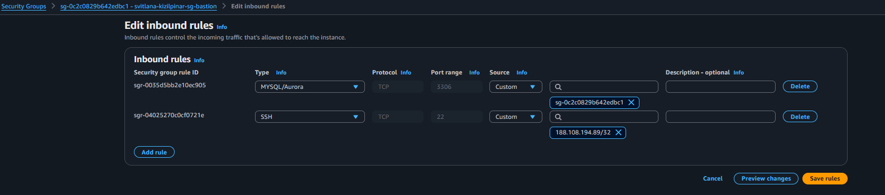

**2.3 Налаштування Outbound Rules (вихідні правила)**
Зазвичай залишаємо правило за замовчуванням:
- **Type**: All traffic
- **Protocol**: All
- **Port Range**: All
- **Destination**: 0.0.0.0/0
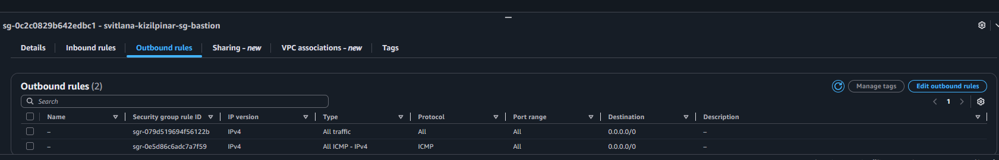

### Крок 3: Створення RDS MySQL Database

#### Як потрапити до створення RDS:
1. Поверніться до сервісу **Amazon RDS** в AWS Console
2. На головній сторінці RDS натисніть **"Create database"**
3. Почнеться майстер створення бази даних

#### Детальні кроки створення:

**3.1 Початок створення RDS**
На першій сторінці майстра виберіть метод створення:
- Виберіть **"Standard create"** для повного контролю над налаштуваннями
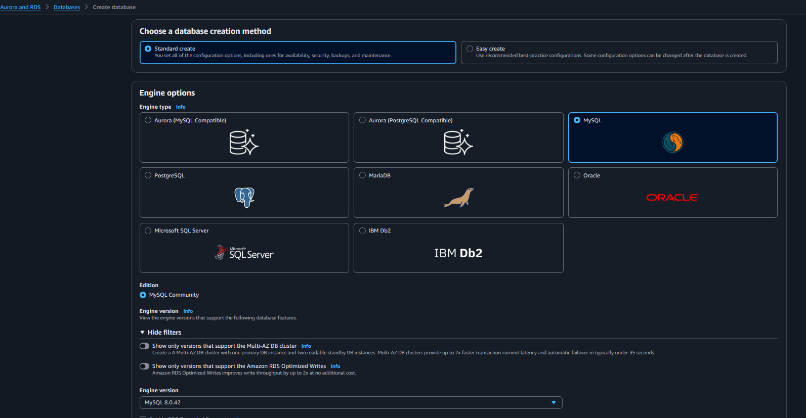

**3.2 Вибір типу бази даних (MySQL)**
В секції **Engine options**:
- **Engine type**: виберіть **MySQL**
- **Engine Version**: оберіть останню стабільну версію (наприклад MySQL 8.0.35)
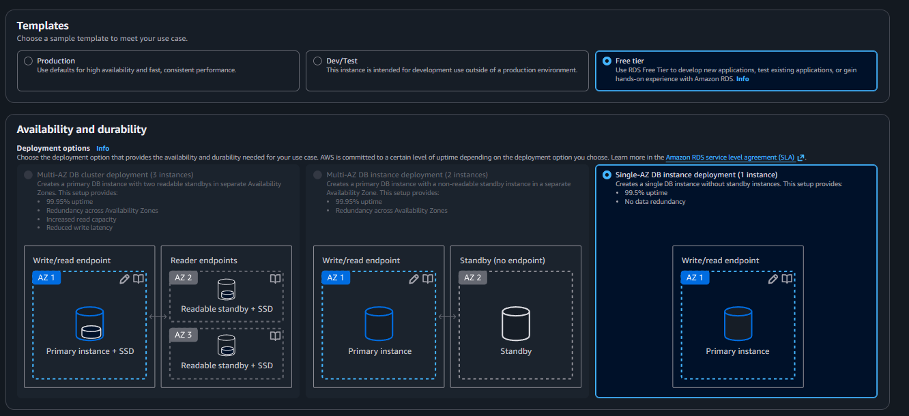

**3.3 Налаштування шаблону**
В секції **Templates**:
- Для навчальних цілей виберіть **"Free tier"** (якщо доступно)
- Або **"Dev/Test"** для мінімальних витрат
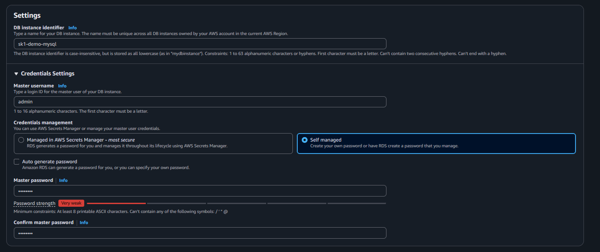

**3.4 Налаштування ідентифікаторів та облікових даних**
В секції **Settings**:
- **DB instance identifier**: введіть унікальне ім'я (наприклад: `my-mysql-db`)
- **Master username**: залишіть `admin` або введіть своє
- **Master password**: створіть надійний пароль або використайте автогенерацію
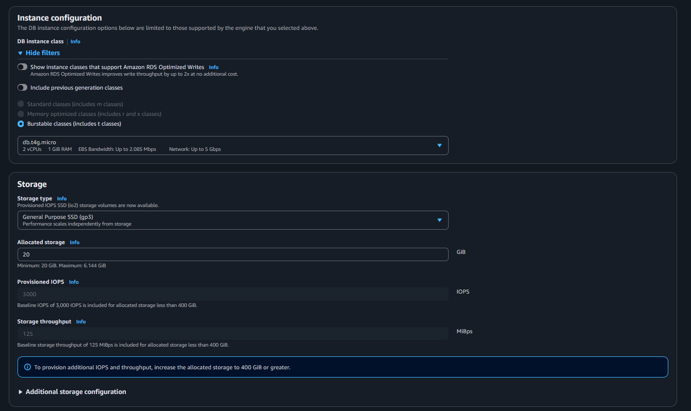

**3.5 Вибір типу інстансу**
В секції **DB instance class**:
- **DB instance class**: для тестування виберіть `db.t3.micro` (найдешевший)
- **Storage type**: оберіть **General Purpose SSD (gp2)**
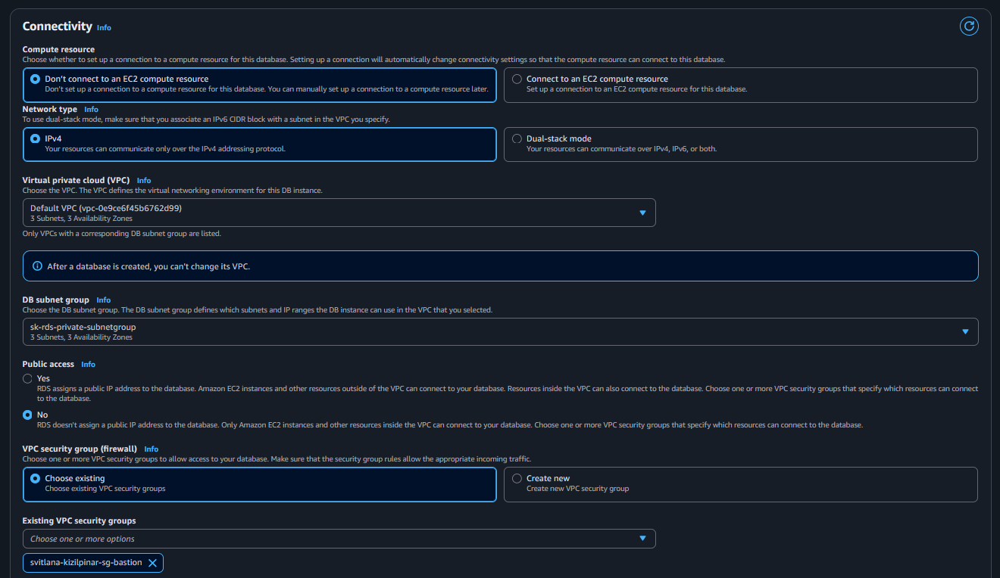

**3.6 Налаштування сховища**
В секції **Storage**:
- **Allocated storage**: мінімум 20 GiB
- **Storage autoscaling**: можна відключити для економії
- **Maximum storage threshold**: встановіть ліміт (наприклад 100 GiB)
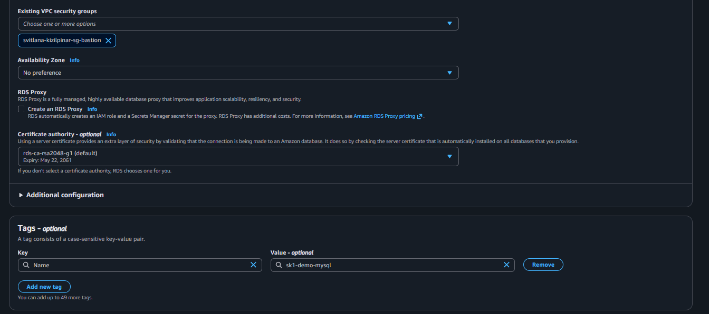

**3.7 Налаштування підключення**
В секції **Connectivity**:
- **VPC**: виберіть ту саму VPC, що використовували для subnet group
- **DB Subnet group**: виберіть створену раніше subnet group
- **Public access**: виберіть **No** (для безпеки)
- **VPC security groups**: виберіть створену раніше security group
- **Availability Zone**: можна залишити **No preference**
- **Database port**: залишіть **3306**
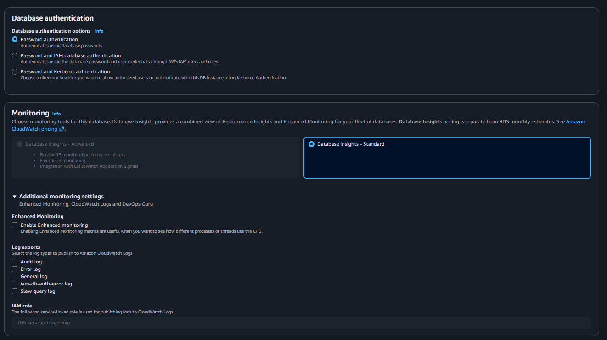

**3.8 Додаткові налаштування**
В секції **Database options**:
- **Initial database name**: введіть ім'я початкової БД (наприклад: `testdb`)
- **DB parameter group**: залишіть за замовчуванням
- **Option group**: залишіть за замовчуванням
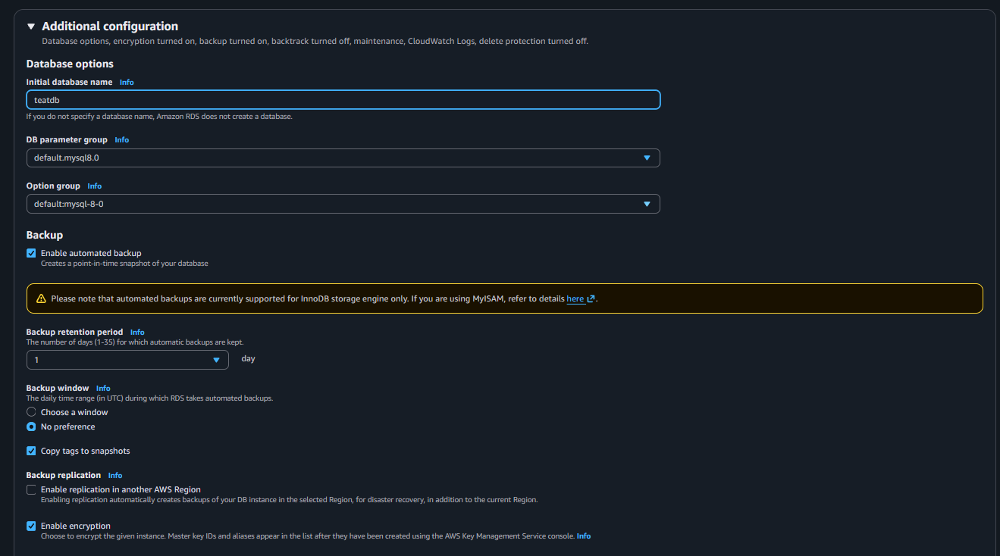

**3.9 Налаштування моніторингу**
В секції **Monitoring**:
- **Enable Enhanced monitoring**: можна відключити для економії
- **Monitoring Role**: залишіть за замовчуванням якщо включили моніторинг
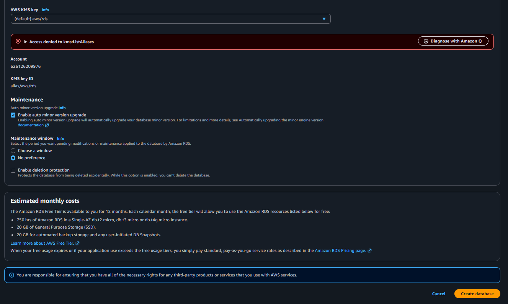

**3.10 Фінальне створення**
Перевірте всі налаштування та натисніть **"Create database"**
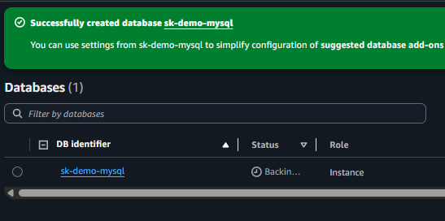

**3.11 Підтвердження створення RDS**
Почнеться процес створення, який може тривати 10-15 хвилин
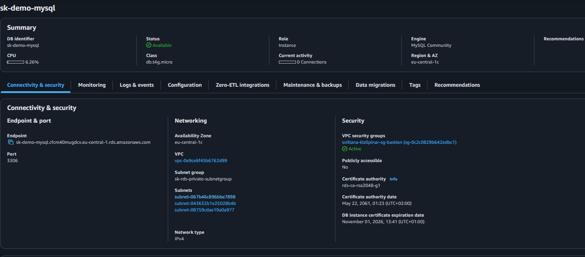

### Крок 4: Створення EC2 інстансу для підключення до RDS

Оскільки RDS знаходиться в приватній мережі, створюємо EC2 інстанс для підключення до бази даних.

#### Як потрапити до створення EC2:
1. В **AWS Management Console** знайдіть сервіс **EC2**
2. Натисніть **"Launch instances"** або **"Launch instance"**
3. Почнеться майстер створення EC2 інстансу

#### Детальні кроки створення:

**4.1 Створення EC2 інстансу**
На першій сторінці:
- **Name**: введіть ім'я інстансу (наприклад: `mysql-client-ec2`)
- **Application and OS Images**: виберіть **Ubuntu Server 22.04 LTS** (безкоштовно)
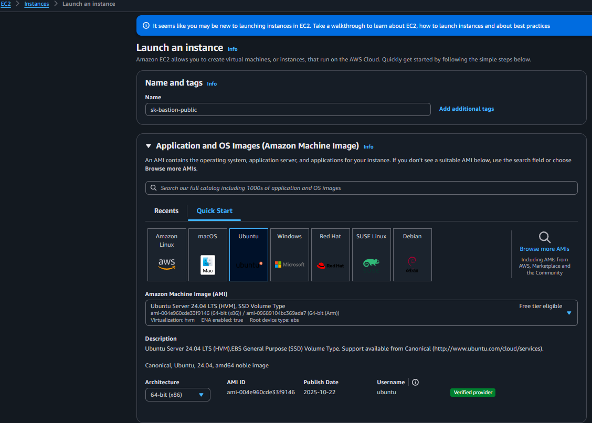

**4.2 Налаштування EC2**
Виберіть тип інстансу:
- **Instance type**: оберіть **t2.micro** або **t3.micro** (free tier eligible)
- **Key pair**: створіть нову або виберіть існуючу key pair для SSH доступу
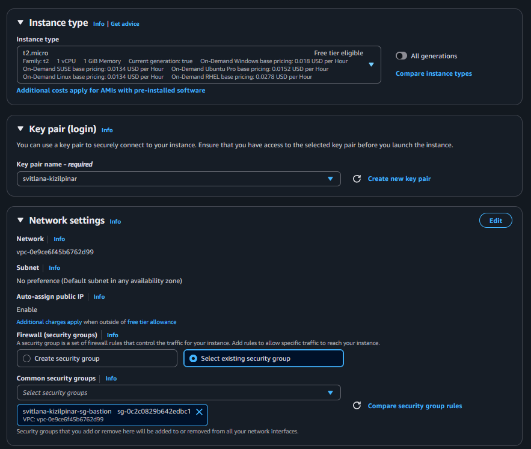

**4.3 Вибір AMI та типу інстансу**
Підтвердіть вибір:
- **AMI**: Ubuntu Server 22.04 LTS
- **Architecture**: x86_64
- **Instance type**: t2.micro
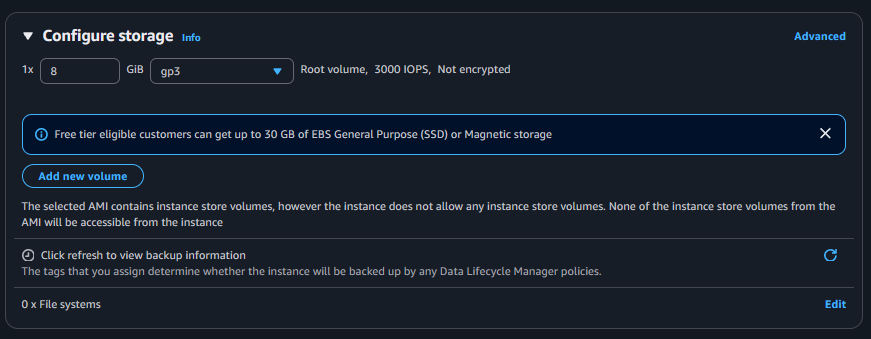

**4.4 Налаштування мережі та безпеки**
В секції **Network settings**:
- **VPC**: виберіть ту саму VPC, що і для RDS
- **Subnet**: виберіть публічну subnet
- **Auto-assign public IP**: Enable
- **Security group**: створіть нову або виберіть існуючу з правилами SSH
- **Source type**: My IP (для безпеки)
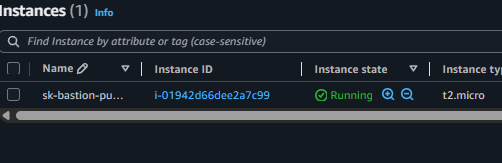

### Крок 5: Підключення до EC2 інстансу

#### Як підключитися до EC2:
1. В **EC2 Console** знайдіть ваш створений інстанс
2. Виберіть інстанс та натисніть **"Connect"**
3. Виберіть спосіб підключення (SSH client)
4. Використайте надані команди для підключення

#### Детальні кроки підключення:

**5.1 SSH підключення до EC2**
Відкрийте термінал та виконайте команду:
```bash
chmod 400 your-key.pem
ssh -i "your-key.pem" ubuntu@your-ec2-public-ip
```
**Примітка**: Для Ubuntu AMI використовується користувач `ubuntu`, а не `ec2-user`


### Крок 6: Встановлення MySQL клієнта та підключення до RDS

#### Як встановити MySQL клієнт на EC2:
Після успішного SSH підключення до EC2, виконайте наступні команди в терміналі EC2.

#### Детальні кроки встановлення та підключення:

**6.1 Встановлення MySQL клієнта**
Виконайте команди для оновлення системи та встановлення MySQL:
```bash
sudo apt update -y
sudo apt install mysql-client -y
```
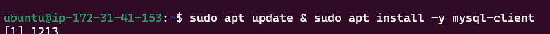

**6.2 Перевірка версії MySQL**
Перевірте, що MySQL клієнт встановлено успішно:
```bash
mysql --version
```
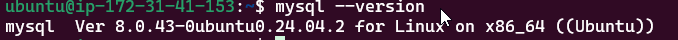

**6.3 Встановлення netcat для перевірки підключення**
Встановіть netcat для тестування мережевого підключення:
```bash
sudo apt install netcat -y
```
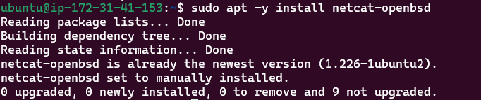

**6.4 Перевірка доступності порту 3306**
Перевірте, чи доступний RDS endpoint на порту 3306:
```bash
nc -zv your-rds-endpoint.region.rds.amazonaws.com 3306
```
Замініть `your-rds-endpoint` на реальний endpoint вашої RDS бази даних
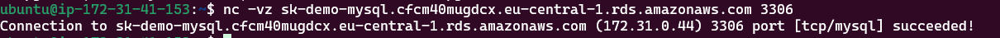

**6.6 Підключення до бази даних**
Підключіться до MySQL RDS за допомогою наступної команди:
```bash
mysql -h your-rds-endpoint.region.rds.amazonaws.com -P 3306 -u admin -p
```
Після введення команди система запросить пароль, який ви встановили при створенні RDS.

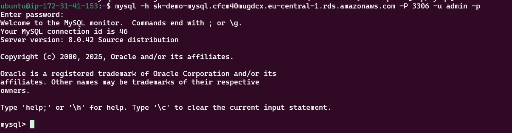

Після успішного підключення ви побачите приглашення MySQL:
```
MySQL [(none)]> 
```

Можете виконати тестові команди:
```sql
SHOW DATABASES;
CREATE DATABASE test_db;
USE test_db;
SHOW TABLES;
```


### Крок 7: Видалення ресурсів

#### Як видалити створені ресурси:
Важливо видалити всі створені ресурси в правильному порядку, щоб уникнути помилок та додаткових витрат.

#### Детальні кроки видалення:

**7.1 Видалення RDS бази даних**
1. Перейдіть до **Amazon RDS Console**
2. В лівому меню виберіть **"Databases"**
3. Знайдіть вашу базу даних в списку
4. Виберіть базу даних та натисніть **"Actions"** → **"Delete"**
5. Підтвердіть видалення:
   - **Create final snapshot?**: виберіть **"No"** (якщо не потрібно зберігати дані)
   - **Delete automated backups?**: виберіть **"Yes"**
   - Введіть **"delete me"** для підтвердження
   - Натисніть **"Delete"**

Процес видалення може тривати кілька хвилин.
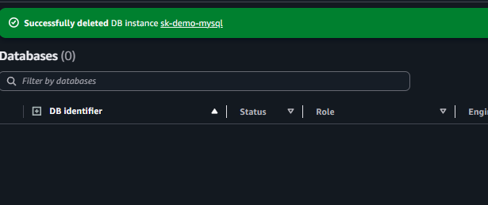

**7.2 Видалення Security Group**
1. Перейдіть до **EC2 Console**
2. В лівому меню виберіть **"Security Groups"**
3. Знайдіть створену раніше security group для RDS
4. Виберіть security group та натисніть **"Actions"** → **"Delete security group"**
5. Підтвердіть видалення натиснувши **"Delete"**

**Важливо**: Спочатку видаліть RDS, а потім security group, інакше буде помилка про залежності.
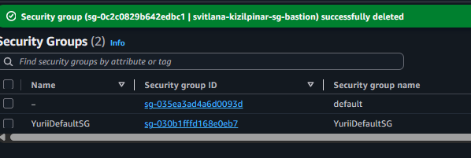

**7.3 Видалення Subnet Group**
1. Поверніться до **Amazon RDS Console**
2. В лівому меню виберіть **"Subnet groups"**
3. Знайдіть створену раніше subnet group
4. Виберіть subnet group та натисніть **"Delete"**
5. Підтвердіть видалення натиснувши **"Delete"** в модальному вікні

**Важливо**: Subnet group можна видалити тільки після видалення всіх RDS інстансів, які її використовують.
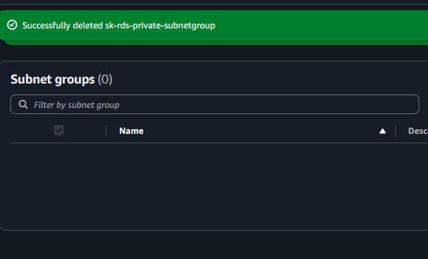

#### Додатково:
- **EC2 інстанс**: також видаліть EC2 інстанс через EC2 Console → Instances → Terminate instance
- **Key Pair**: якщо створювали нову, можете видалити через EC2 Console → Key Pairs

## Команди для підключення

### Підготовка SSH ключа:
```bash
# Встановіть правильні дозволи для SSH ключа
chmod 400 your-key.pem
```

### Підключення до EC2:
```bash
# Підключення до EC2 інстансу (Ubuntu)
ssh -i "your-key.pem" ubuntu@your-ec2-public-ip

# Приклад:
ssh -i "my-key.pem" ubuntu@3.23.45.67
```

### Встановлення MySQL клієнта на EC2 (Ubuntu):
```bash
# Оновлення системи
sudo apt update -y

# Встановлення MySQL клієнта
sudo apt install mysql-client -y

# Встановлення netcat для тестування
sudo apt install netcat -y
```

### Тестування підключення до RDS:
```bash
# Перевірка доступності RDS endpoint
nc -zv your-rds-endpoint.region.rds.amazonaws.com 3306

# Приклад:
nc -zv mydb.c1234567890.us-east-1.rds.amazonaws.com 3306
```

### Підключення до RDS MySQL:
```bash
# Підключення до MySQL RDS
mysql -h your-rds-endpoint.region.rds.amazonaws.com -P 3306 -u admin -p

# Приклад:
mysql -h mydb.c1234567890.us-east-1.rds.amazonaws.com -P 3306 -u admin -p
```

### Базові MySQL команди для тестування:
```sql
-- Показати всі бази даних
SHOW DATABASES;

-- Створити тестову базу даних
CREATE DATABASE test_db;

-- Вибрати базу даних
USE test_db;

-- Створити тестову таблицю
CREATE TABLE users (
    id INT AUTO_INCREMENT PRIMARY KEY,
    name VARCHAR(50),
    email VARCHAR(100)
);

-- Вставити тестові дані
INSERT INTO users (name, email) VALUES ('John Doe', 'john@example.com');

-- Показати дані
SELECT * FROM users;

-- Вийти з MySQL
EXIT;
```

### Отримання RDS endpoint:
1. AWS Console → RDS → Databases → виберіть вашу БД → вкладка "Connectivity & security"
2. Скопіюйте значення з поля "Endpoint"

## Результат виконання завдання

✅ **Створено RDS MySQL базу даних**  
✅ **Успішно підключено до бази даних з EC2 інстансу**  
✅ **Видалено всі створені ресурси**  

## Важливі моменти

1. **Security Group** - обов'язково налаштувати правила для доступу до MySQL (порт 3306)
2. **Subnet Group** - RDS повинна бути в тій же VPC що і EC2 для підключення
3. **Endpoint** - використовувати endpoint RDS для підключення, а не IP адресу
4. **Видалення** - обов'язково видалити всі ресурси для уникнення додаткових витрат

## Технічні деталі

- **Engine**: MySQL 8.0
- **Instance Class**: db.t3.micro (або інший за вибором)
- **Storage**: 20 GB GP2
- **Port**: 3306
- **Public Access**: No (підключення через EC2)
- **EC2 OS**: Ubuntu Server 22.04 LTS
- **EC2 User**: ubuntu (не ec2-user!)
- **Package Manager**: apt (не yum!)