# Task 3: AWS Lambda - Автоматична зупинка EC2 за тегом за розкладом

## Завдання
Напишіть функцію AWS Lambda, яка буде запускатися за розкладом (cron) о 12:00 дня і зупинятиме всі EC2-екземпляри, що працюють із певним тегом. Використайте мову Python та бібліотеку boto3 для реалізації функції.

## Покрокова інструкція

### Передумови
- **Регіон**: eu-central-1 (Frankfurt) — використовуйте один і той самий регіон для всіх кроків
- **Тег**: EC2 інстанси матимуть тег `AutoStop = true`

### Крок 1: Створення Security Group для EC2 (підготовка)

#### Як потрапити до створення Security Group:
1. В **AWS Management Console** знайдіть сервіс **EC2**
2. В лівому меню знайдіть секцію **"Network & Security"**
3. Виберіть **"Security Groups"**
4. Натисніть кнопку **"Create security group"**

#### Детальні кроки створення:

**1.1 Створення Security Group**
- **Security group name**: введіть назву (наприклад: `lambda-test-sg`)
- **Description**: додайте опис (наприклад: `Security group for Lambda test EC2`)
- **VPC**: виберіть default VPC
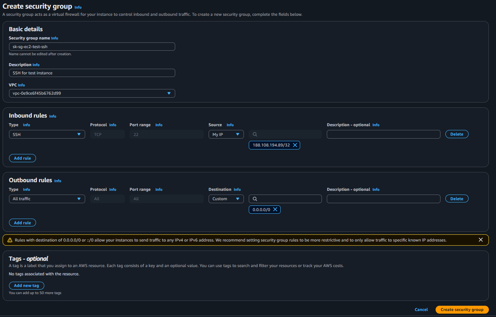

**1.2 Налаштування Security Group Rules**
Додайте необхідні правила для тестування:
- **Inbound rules**: SSH (port 22) для доступу
- **Outbound rules**: залишіть за замовчуванням
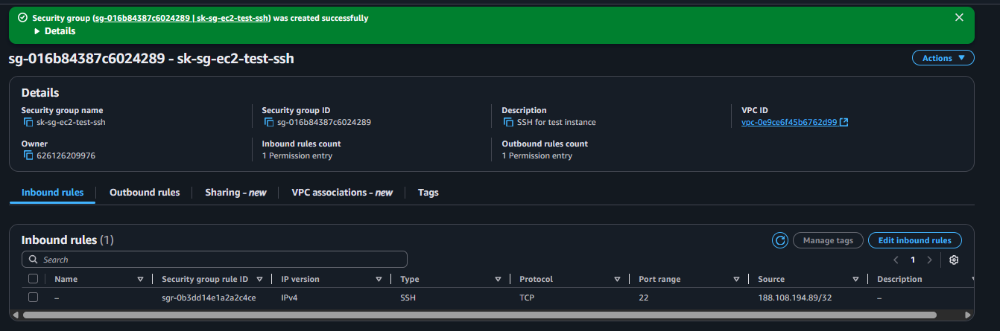

### Крок 2: Створення EC2 інстансу для тестування

#### Як потрапити до створення EC2:
1. В **EC2 Console** натисніть **"Launch instances"**
2. Почнеться майстер створення EC2 інстансу

#### Детальні кроки створення:

**2.1 Початкові налаштування EC2**
- **Name**: введіть ім'я (наприклад: `lambda-test-ec2`)
- **AMI**: виберіть **Amazon Linux 2023** або **Ubuntu**
- **Instance type**: оберіть **t2.micro** (free tier)
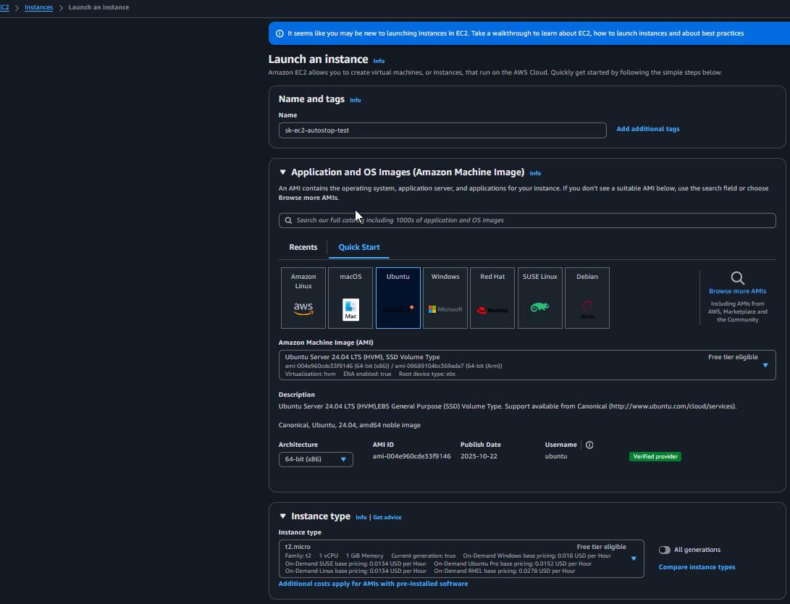

**2.2 Налаштування мережі**
- **Key pair**: виберіть або створіть нову key pair
- **Security group**: виберіть створену раніше security group
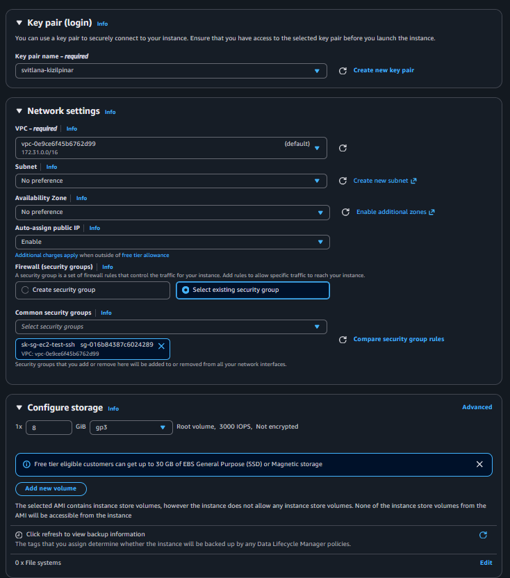

**2.3 Фінальне створення EC2**
Перевірте налаштування та натисніть **"Launch instance"**
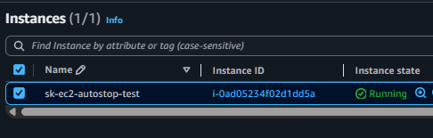

### Крок 3: Створення IAM ролі для Lambda

#### Як потрапити до створення IAM ролі:
1. В **AWS Management Console** знайдіть сервіс **IAM**
2. В лівому меню виберіть **"Roles"**
3. Натисніть **"Create role"**

#### Детальні кроки створення:

**3.1 Налаштування Trusted Entity**
- **Trusted entity type**: виберіть **"AWS service"**
- **Use case**: виберіть **"Lambda"**
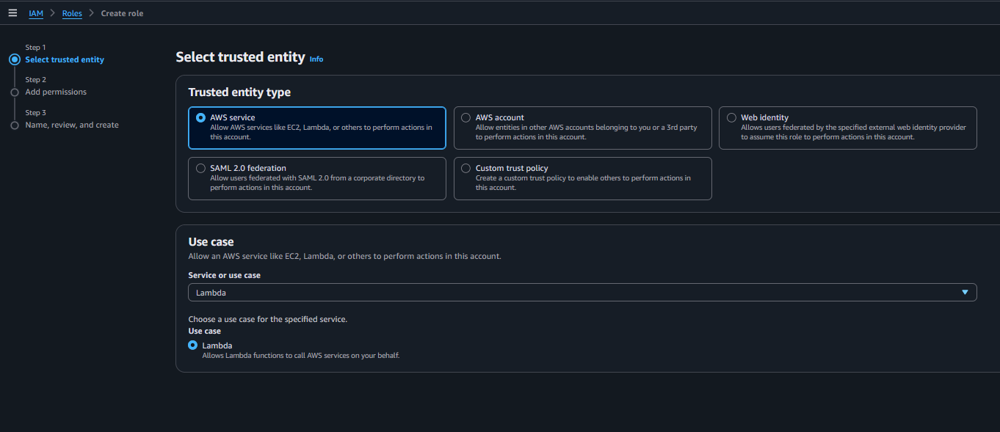

**3.2 Додавання базових permissions**
Спочатку додайте базову політику для Lambda:
- Знайдіть та виберіть **"AWSLambdaBasicExecutionRole"**
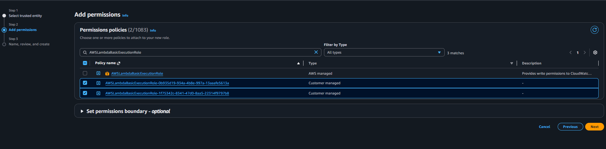

**3.3 Налаштування імені ролі**
- **Role name**: введіть назву (наприклад: `lambda-stop-ec2-by-tag-role`)
- **Description**: додайте опис ролі
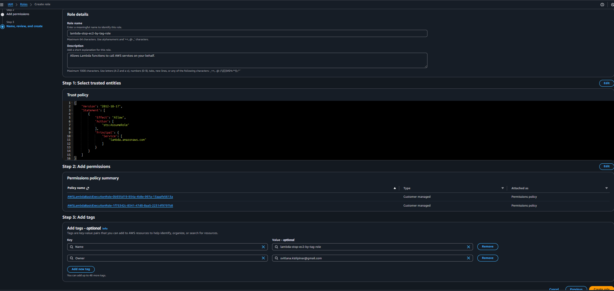

**3.4 Створення ролі**
Перевірте налаштування та натисніть **"Create role"**
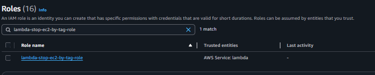

**3.5 Додавання додаткових permissions**
Після створення ролі, відкрийте її та натисніть **"Add permissions"** → **"Create inline policy"**
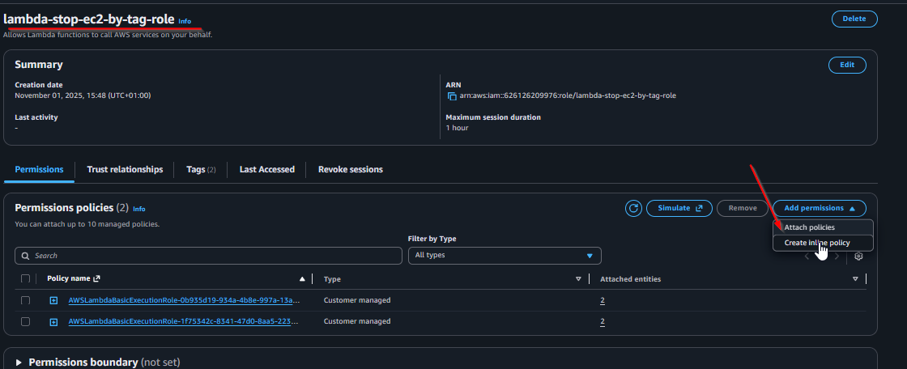

**3.6 Створення inline policy - JSON**
Виберіть **"JSON"** та вставте наступну політику:
```json
{
  "Version": "2012-10-17",
  "Statement": [
    {
      "Sid": "AllowDescribeInstances",
      "Effect": "Allow",
      "Action": "ec2:DescribeInstances",
      "Resource": "*"
    },
    {
      "Sid": "AllowStopInstancesWithTag",
      "Effect": "Allow",
      "Action": "ec2:StopInstances",
      "Resource": "*",
      "Condition": {
        "StringEquals": {
          "ec2:ResourceTag/AutoStop": "true"
        }
      }
    }
  ]
}
```
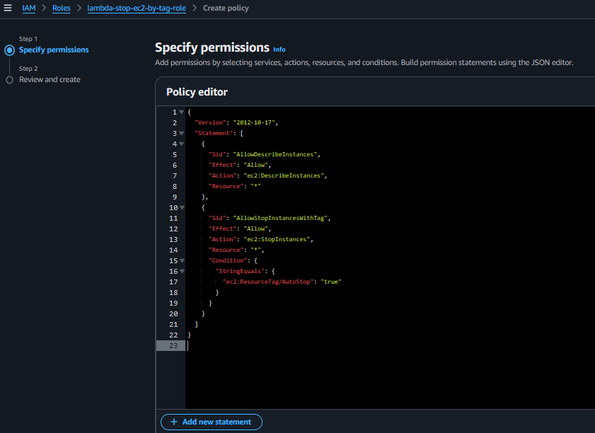

**3.7 Налаштування імені політики**
- **Policy name**: введіть назву (наприклад: `ec2-stop-describe-policy`)
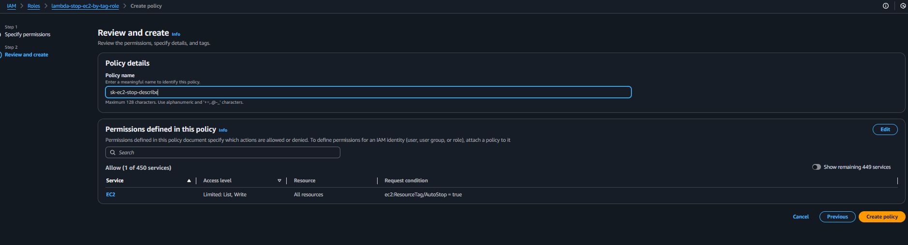

**3.8 Створення політики**
Натисніть **"Create policy"** для завершення
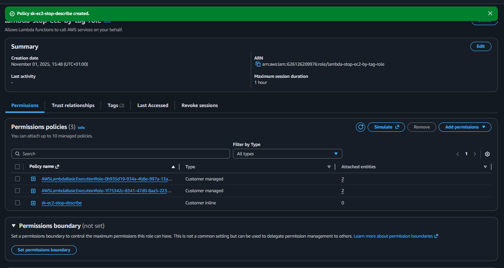

### Крок 4: Створення Lambda функції

#### Як потрапити до створення Lambda:
1. В **AWS Management Console** знайдіть сервіс **Lambda**
2. Натисніть **"Create function"**

#### Детальні кроки створення:

**4.1 Базові налаштування функції**
- **Function option**: виберіть **"Author from scratch"**
- **Function name**: введіть назву (наприклад: `stop-ec2-by-tag`)
- **Runtime**: виберіть **"Python 3.12"** або **"Python 3.13"**
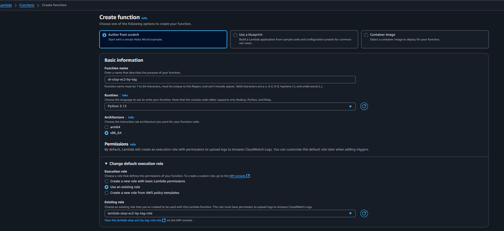

**4.2 Налаштування permissions**
- **Execution role**: виберіть **"Use an existing role"**
- **Existing role**: виберіть створену раніше роль `lambda-stop-ec2-by-tag-role`
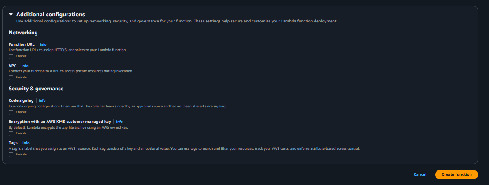

**4.3 Створення функції**
Натисніть **"Create function"**
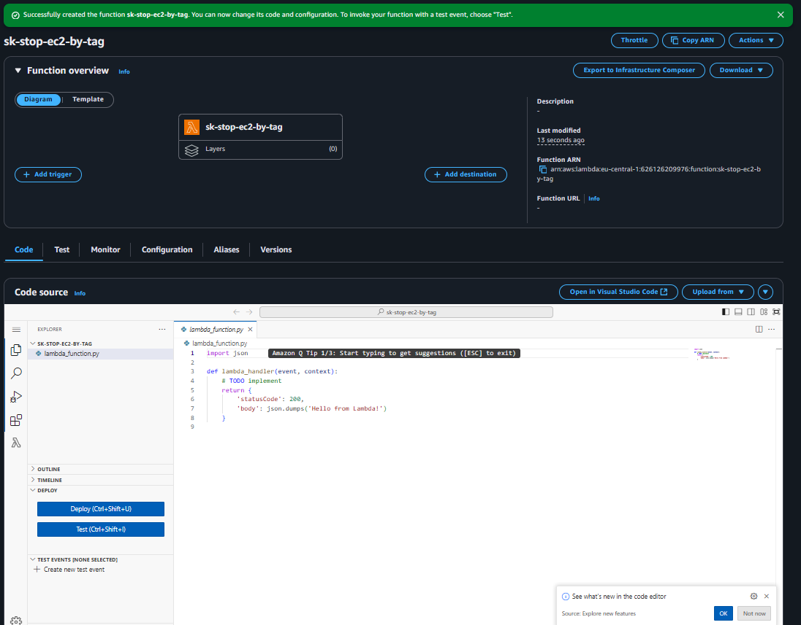

**4.4 Додавання коду функції**
В розділі **"Code"** замініть код на наступний:
```python
import os
import boto3

ec2 = boto3.client("ec2")

TAG_KEY = os.environ.get("TAG_KEY", "AutoStop")
TAG_VALUE = os.environ.get("TAG_VALUE", "true")

def lambda_handler(event, context):
    # знайти всі running інстанси з тегом TAG_KEY=TAG_VALUE
    filters = [
        {"Name": f"tag:{TAG_KEY}", "Values": [TAG_VALUE]},
        {"Name": "instance-state-name", "Values": ["running"]},
    ]
    ids, token = [], None
    while True:
        resp = ec2.describe_instances(Filters=filters, NextToken=token) if token else ec2.describe_instances(Filters=filters)
        for r in resp.get("Reservations", []):
            for i in r.get("Instances", []):
                ids.append(i["InstanceId"])
        token = resp.get("NextToken")
        if not token:
            break

    # зупинити знайдені
    if ids:
        ec2.stop_instances(InstanceIds=ids)

    return {"stopped": ids}
```
Натисніть **"Deploy"** для збереження
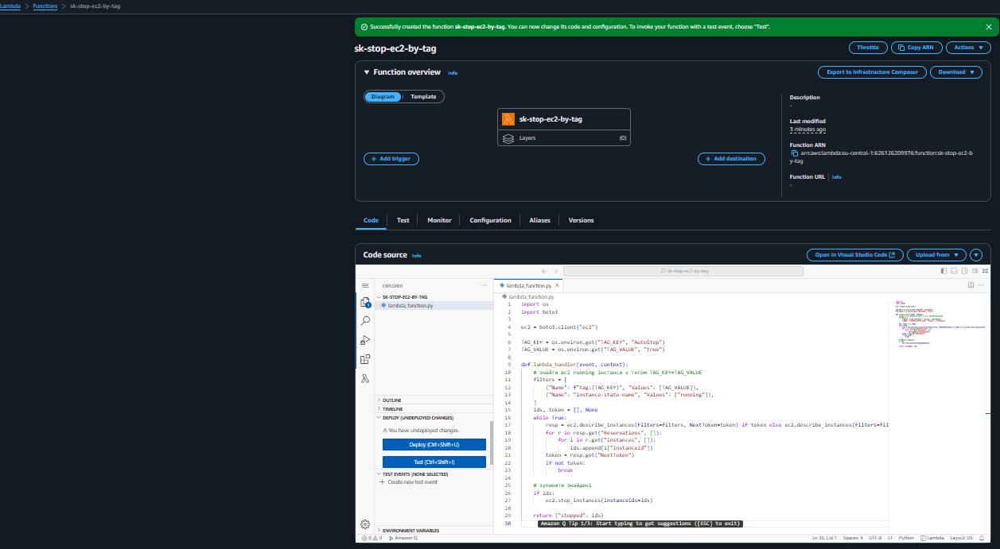

**4.5 Налаштування Environment Variables**
Перейдіть до вкладки **"Configuration"** → **"Environment variables"** → **"Edit"**


**4.6 Додавання змінних середовища**
Додайте наступні змінні:
- **KEY**: `TAG_KEY`, **VALUE**: `AutoStop`
- **KEY**: `TAG_VALUE`, **VALUE**: `true`
Натисніть **"Save"**
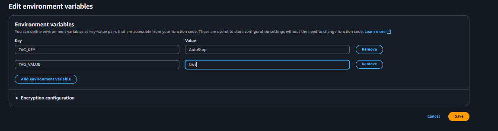

**4.7 Налаштування Timeout**
Перейдіть до **"General configuration"** → **"Edit"**
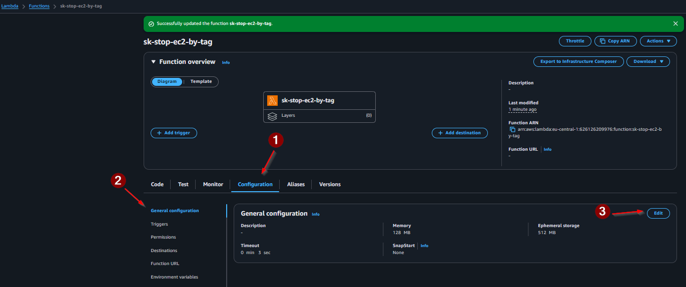

**4.8 Зміна Timeout**
Змініть **Timeout** на **30 секунд** або **1 хвилину** та натисніть **"Save"**
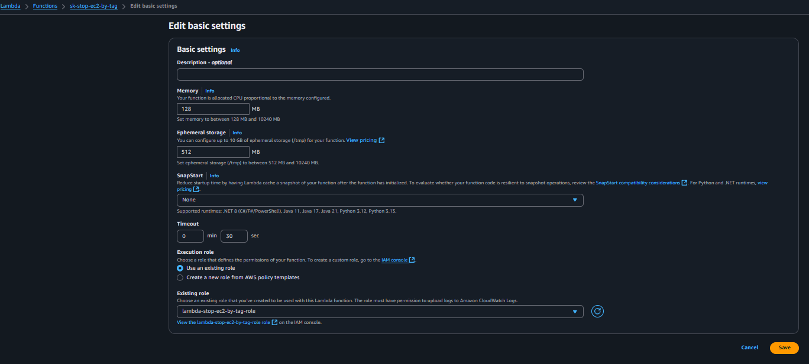

### Крок 5: Додавання тегу до EC2 інстансу

#### Як додати тег до EC2:
1. В **EC2 Console** знайдіть ваш інстанс
2. Виберіть інстанс → вкладка **"Tags"** → **"Manage tags"**

#### Детальні кроки:

**5.1 Додавання тегу AutoStop**
- **Key**: `AutoStop`
- **Value**: `true`
- Натисніть **"Save changes"**

**Важливо**: Переконайтеся, що інстанс знаходиться в стані **"Running"**
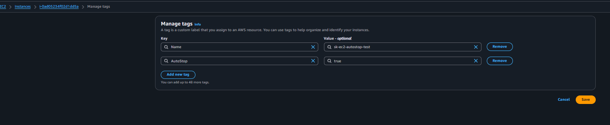

### Крок 6: Тестування Lambda функції

#### Як протестувати Lambda:
1. В **Lambda Console** відкрийте вашу функцію
2. Натисніть **"Test"**

#### Детальні кроки тестування:

**6.1 Створення тестового event**
- Натисніть **"Test"** → **"Create new test event"**
- **Event name**: введіть назву (наприклад: `test-event`)
- **Event JSON**: можна залишити за замовчуванням `{}`
- Натисніть **"Test"**
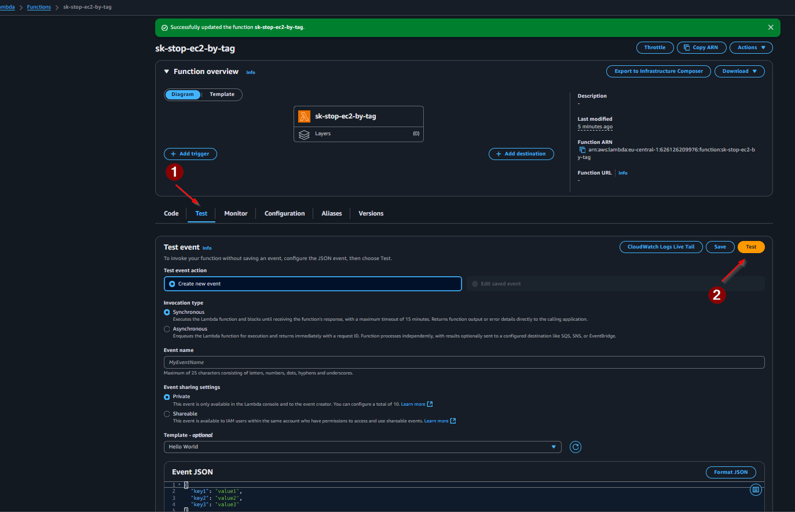

**6.2 Результат тестування**
Ви побачите результат виконання функції:
```json
{
  "stopped": ["i-xxxxxxxxxxxxxxxxx"]
}
```
Це означає, що функція знайшла та зупинила EC2 інстанс
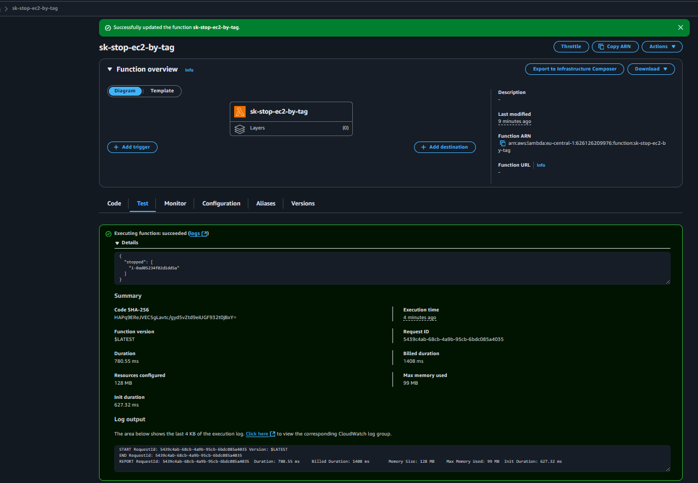

**6.3 Перевірка статусу EC2**
Перейдіть до **EC2 Console** та перевірте, що інстанс змінив статус на **"Stopping"** або **"Stopped"**
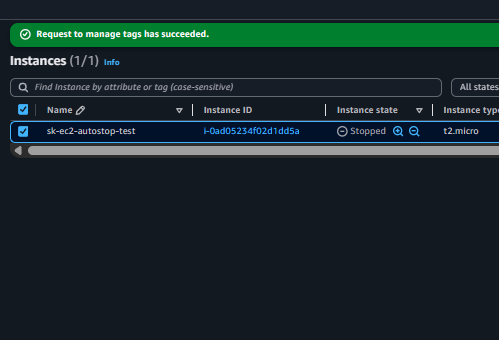

### Крок 7: Створення розкладу (EventBridge Scheduler)

#### Як потрапити до EventBridge Scheduler:
1. В **AWS Management Console** знайдіть сервіс **Amazon EventBridge**
2. В лівому меню виберіть **"Scheduler"** → **"Schedules"**
3. Натисніть **"Create schedule"**

#### Детальні кроки створення розкладу:

**7.1 Налаштування розкладу**
- **Schedule name**: введіть назву (наприклад: `stop-ec2-12pm-schedule`)
- **Schedule pattern**: виберіть **"Recurring schedule"**
- **Schedule type**: виберіть **"Cron-based"**
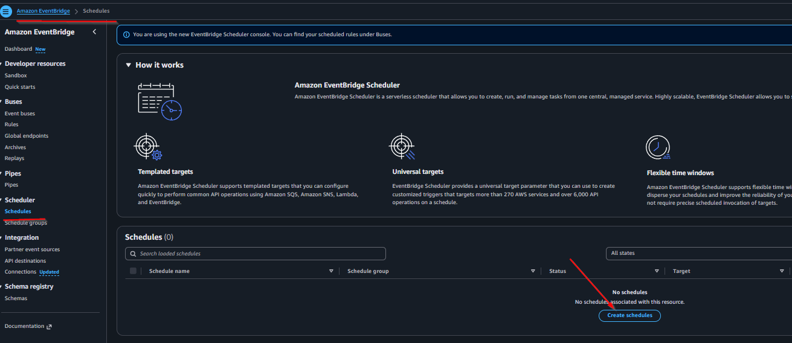

**7.2 Налаштування Cron виразу**
- **Cron expression**: `0 12 * * ? *` (щодня о 12:00)
- **Time zone**: виберіть **"Europe/Berlin"**
- **Flexible time window**: виберіть **"Off"**
Натисніть **"Next"**
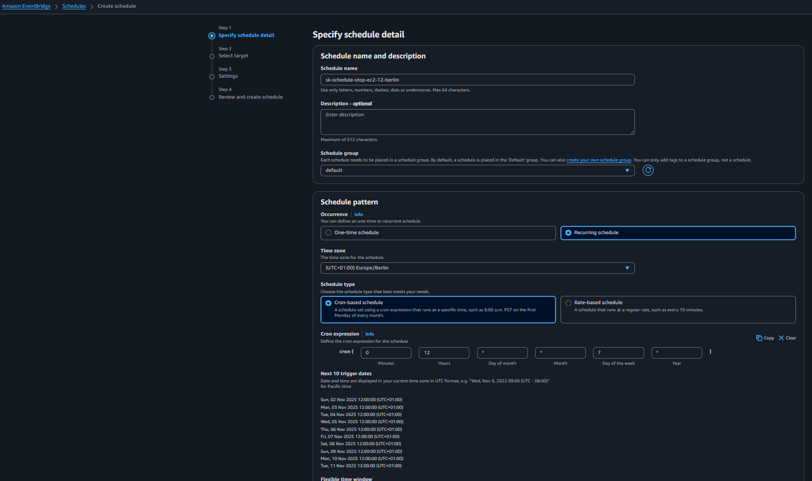

**7.3 Вибір Target**
- **Target**: виберіть **"AWS Lambda"**
- **Invoke**: залишіть за замовчуванням
Натисніть **"Next"**
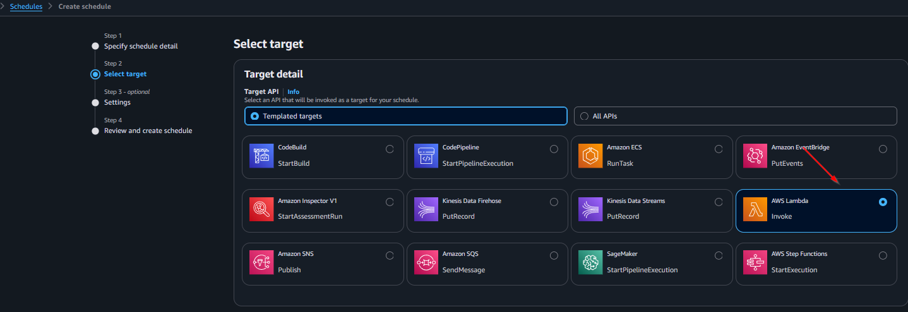

**7.4 Налаштування Lambda Target**
- **Lambda function**: виберіть вашу функцію `stop-ec2-by-tag`
- **Payload**: залишіть порожнім або введіть `{}`
Натисніть **"Next"**
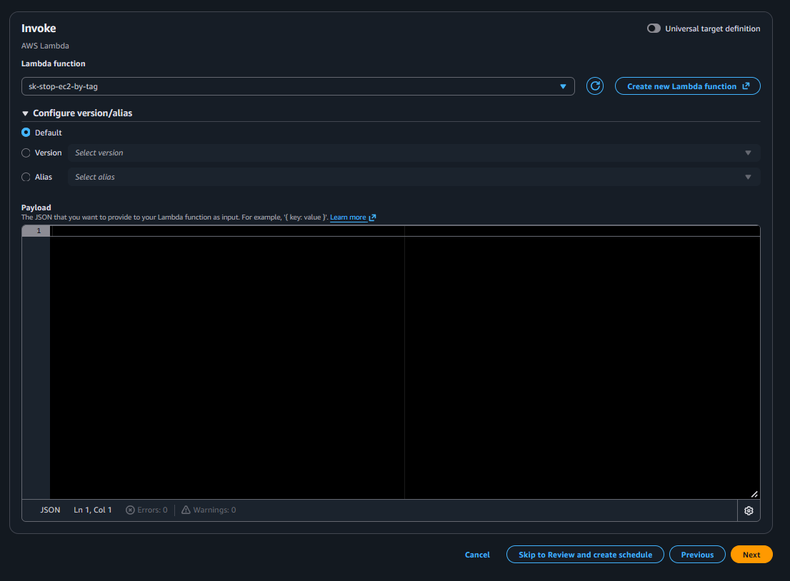

**7.5 Налаштування Settings**
- **Enable schedule**: увімкніть **"Enable"**
- **Retry policy**: залишіть за замовчуванням
- **Execution role**: виберіть **"Create new role for this schedule"**
Натисніть **"Next"**
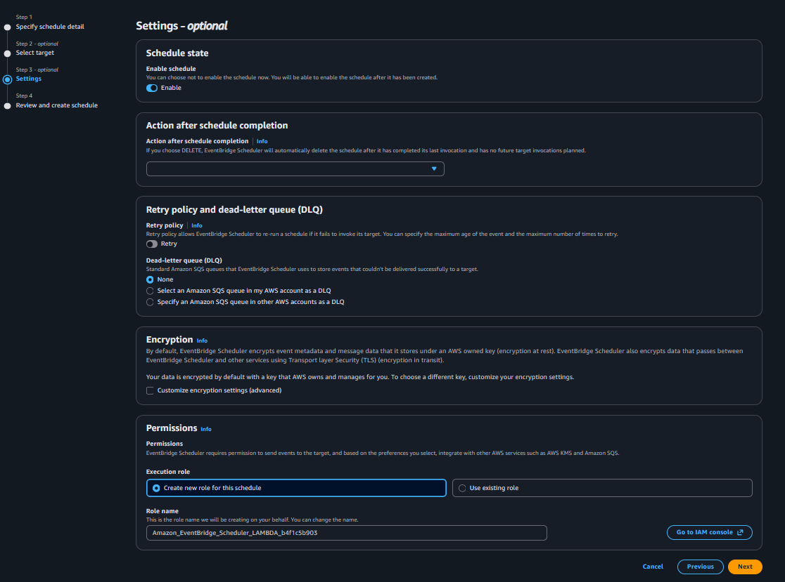

**7.6 Створення розкладу**
Перевірте всі налаштування та натисніть **"Create schedule"**
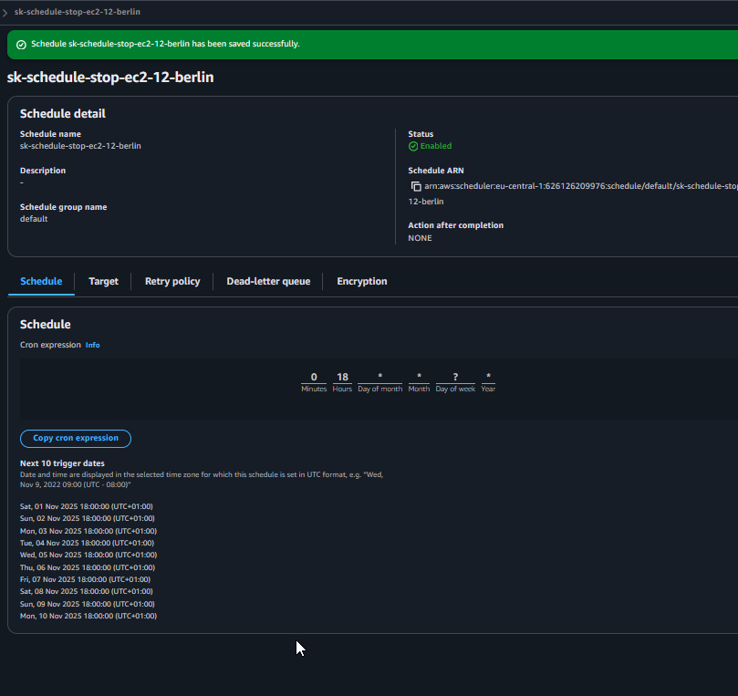

### Крок 8: Результат роботи

**8.1 Автоматична зупинка EC2**
Після спрацювання розкладу EC2 інстанси з тегом `AutoStop=true` будуть автоматично зупинені
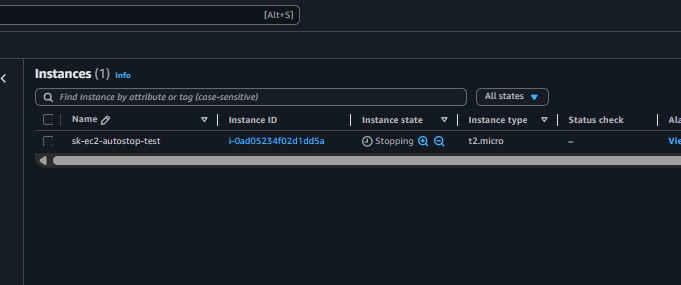

## Код Lambda функції

```python
import os
import boto3

ec2 = boto3.client("ec2")

TAG_KEY = os.environ.get("TAG_KEY", "AutoStop")
TAG_VALUE = os.environ.get("TAG_VALUE", "true")

def lambda_handler(event, context):
    # знайти всі running інстанси з тегом TAG_KEY=TAG_VALUE
    filters = [
        {"Name": f"tag:{TAG_KEY}", "Values": [TAG_VALUE]},
        {"Name": "instance-state-name", "Values": ["running"]},
    ]
    ids, token = [], None
    while True:
        resp = ec2.describe_instances(Filters=filters, NextToken=token) if token else ec2.describe_instances(Filters=filters)
        for r in resp.get("Reservations", []):
            for i in r.get("Instances", []):
                ids.append(i["InstanceId"])
        token = resp.get("NextToken")
        if not token:
            break

    # зупинити знайдені
    if ids:
        ec2.stop_instances(InstanceIds=ids)

    return {"stopped": ids}
```

## Налаштування Environment Variables

| Ключ | Значення | Опис |
|------|----------|------|
| TAG_KEY | AutoStop | Ключ тегу для фільтрації EC2 |
| TAG_VALUE | true | Значення тегу для фільтрації |

## Cron вираз для розкладу

```
0 12 * * ? *
```

**Пояснення**:
- `0` - хвилини (0-а хвилина)
- `12` - години (12-а година = 12:00 PM)
- `*` - день місяця (щодня)
- `*` - місяць (щомісяця)
- `?` - день тижня (ігнорується)
- `*` - рік (щороку)

## Видалення ресурсів

### Порядок видалення:
1. **EventBridge Schedule**: EventBridge → Scheduler → Schedules → виберіть розклад → Delete
2. **Lambda Function**: Lambda → Functions → виберіть функцію → Actions → Delete
3. **IAM Role**: IAM → Roles → виберіть роль → Delete (спочатку видаліть inline policy)
4. **EC2 Instance**: EC2 → Instances → виберіть інстанс → Instance state → Terminate
5. **Security Group**: EC2 → Security Groups → виберіть групу → Actions → Delete

## Результат виконання завдання

✅ **Створено IAM роль з необхідними правами**  
✅ **Створено Lambda функцію на Python з boto3**  
✅ **Налаштовано автоматичний розклад через EventBridge**  
✅ **Протестовано автоматичну зупинку EC2 за тегом**  
✅ **Видалено всі створені ресурси**  

## Важливі моменти

1. **Регіон**: Всі ресурси мають бути в одному регіоні (eu-central-1)
2. **Теги**: EC2 інстанс повинен мати тег `AutoStop=true` (саме "true" малими літерами)
3. **IAM права**: Роль Lambda має мати права на `ec2:DescribeInstances` та `ec2:StopInstances`
4. **Часовий пояс**: Використовуйте Europe/Berlin для коректного часу
5. **Тестування**: Обов'язково протестуйте функцію вручну перед налаштуванням розкладу

## Технічні деталі

- **Runtime**: Python 3.12/3.13
- **Timeout**: 30 секунд
- **Memory**: 128 MB (за замовчуванням)
- **Architecture**: x86_64
- **Trigger**: EventBridge Scheduler (cron)
- **Permissions**: IAM роль з EC2 правами